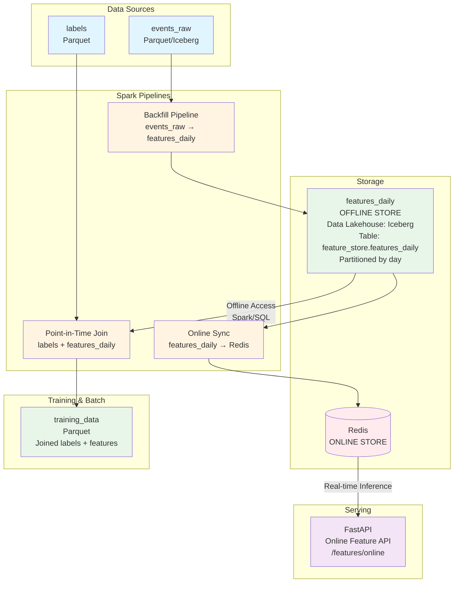

# Mini Feature Store

A production-ready feature store implementation demonstrating proper ML feature engineering practices: point-in-time joins, offline/online parity, backfills, freshness tracking, and feature serving.

## Architecture Diagram



## Tech Stack

- **Spark (Scala)**: Data processing pipelines
- **Iceberg**: Table format for features_daily (on MinIO/local FS)
- **Parquet**: File format for events_raw, labels, training_data
- **Redis**: Online feature store for low-latency serving
- **FastAPI**: Feature serving API
- **Docker Compose**: One-command infrastructure setup

## Features

### ✅ Point-in-Time Joins
Ensures no data leakage: labels at time T only use features from time ≤ T.

### ✅ Offline/Online Parity
Same features available in both Iceberg (offline) and Redis (online).

### ✅ Backfills
Historical feature computation from events_raw to features_daily.

### ✅ Freshness Tracking
Online sync keeps Redis updated with latest 24h of features.

### ✅ Feature Serving API
RESTful API for **online feature serving only**:
- **Online**: Latest features from Redis (`/features/online/{user_id}`) - for real-time inference

**Offline Features**: Accessed programmatically via Spark/SQL (see examples below), not via REST API.

## Project Structure

```
mini-feature-store/
├── spark/                    # Spark/Scala pipelines
│   ├── src/main/scala/
│   │   ├── platform/         # Platform abstractions
│   │   └── com/example/featurestore/
│   │       ├── domain/       # Schemas and models
│   │       ├── pipelines/    # Backfill, PIT join, online sync
│   │       └── App.scala    # Main entry point
│   └── src/test/scala/       # Tests including data leakage validation
├── api/                       # FastAPI service (online serving only)
│   ├── main.py              # FastAPI app setup
│   ├── online.py            # Online feature serving (Redis) - production
│   ├── offline.py           # Offline endpoint (development/debugging only)
│   ├── models.py            # Shared Pydantic models
│   └── requirements.txt
├── docker/                   # Docker Compose setup
│   └── docker-compose.yml   # MinIO, Redis, API
├── scripts/                  # Utility scripts
│   └── generate_sample_data.py
└── Makefile                  # Demo commands
```

## Quick Start

### Prerequisites

- Docker and Docker Compose
- Java 17+
- SBT 1.9.6+
- Python 3.11+ (for API and scripts)

### Run Full Demo

```bash
# One command to run everything
make demo
```

This will:
1. Start Docker services (MinIO, Redis, API)
2. Generate sample data
3. Run backfill pipeline
4. Run point-in-time join
5. Sync features to Redis
6. Start API server

### Manual Steps

```bash
# 1. Setup infrastructure
make setup
make docker-up

# 2. Generate sample data
python scripts/generate_sample_data.py

# 3. Build Spark JAR
make build

# 4. Run backfill pipeline
cd spark && sbt "runMain com.example.featurestore.App backfill \
  --events-raw-path file:///tmp/events_raw \
  --output-table feature_store.features_daily \
  --start-date 2024-01-01 \
  --end-date 2024-01-07"

# 5. Run point-in-time join
cd spark && sbt "runMain com.example.featurestore.App point-in-time-join \
  --labels-path file:///tmp/labels \
  --features-table feature_store.features_daily \
  --output-path file:///tmp/training_data"

# 6. Sync to Redis
cd spark && sbt "runMain com.example.featurestore.App online-sync \
  --features-table feature_store.features_daily \
  --redis-host localhost \
  --redis-port 6379"
```

## Feature Access Patterns

### Online Serving (Real-time Inference)

**Use Case**: Low-latency feature retrieval for production model serving.

**Access Method**: REST API

```bash
# Get latest features for a user (from Redis)
curl "http://localhost:8000/features/online/user1"
```

Response:
```json
{
  "user_id": "user1",
  "as_of": "2024-01-07T12:00:00",
  "features": {
    "day": "2024-01-07",
    "event_count_7d": 5,
    "event_count_30d": 15,
    "last_event_days_ago": 0,
    "event_type_counts": "3"
  },
  "source": "online"
}
```

**Production Pattern**: ✅ This matches real-world use cases - online features are served via API for real-time inference.

### Offline Access (Training & Batch Jobs)

**Use Case**: Historical feature retrieval for training data generation and batch inference.

**Access Method**: Programmatic access via Spark/SQL (production pattern)

#### Example 1: Training Data Generation (Point-in-Time Join)

The Point-in-Time Join pipeline demonstrates the correct pattern:

```scala
import org.apache.spark.sql.functions._

// Read features from Iceberg table
val features = spark.read
  .format("iceberg")
  .table("feature_store.features_daily")
  .withColumn("feature_date", col("day"))

// Read labels
val labels = spark.read
  .parquet("file:///tmp/labels")
  .withColumn("as_of_date", to_date(col("as_of_ts")))

// Point-in-time join: feature_day <= as_of_ts_day
val trainingData = labels
  .join(
    features,
    labels("user_id") === features("user_id") &&
      features("feature_date") <= labels("as_of_date"),
    "left"
  )
  .withColumn(
    "rank",
    row_number().over(
      Window
        .partitionBy("user_id", "as_of_ts")
        .orderBy(col("feature_date").desc)
    )
  )
  .filter(col("rank") === 1)
  .select("user_id", "label", "as_of_ts", "day", "event_count_7d", ...)

// Write training data
trainingData.write.parquet("file:///tmp/training_data")
```

#### Example 2: Batch Inference

```scala
// Read features for batch inference
val inferenceUsers = spark.read.parquet("file:///tmp/inference_users")
val as_of_date = "2024-01-05"

val features = spark.read
  .format("iceberg")
  .table("feature_store.features_daily")
  .filter(col("day") <= as_of_date)

// Get latest features per user
val latestFeatures = features
  .withColumn(
    "rank",
    row_number().over(
      Window
        .partitionBy("user_id")
        .orderBy(col("day").desc)
    )
  )
  .filter(col("rank") === 1)
  .drop("rank")

// Join with inference users
val inferenceData = inferenceUsers
  .join(latestFeatures, Seq("user_id"), "left")

// Run batch inference
// ... (use inferenceData with your model)
```

#### Example 3: Direct SQL Query

```sql
-- Query features for a specific user at a point in time
SELECT user_id, day, event_count_7d, event_count_30d
FROM feature_store.features_daily
WHERE user_id = 'user1'
  AND day <= '2024-01-05'
ORDER BY day DESC
LIMIT 1;
```

**Production Pattern**: ✅ Offline features are accessed programmatically via Spark/SQL for:
- Training data generation (Point-in-Time Join pipeline)
- Batch inference jobs
- Analytics and reporting
- NOT via REST API

**Note**: A development/debugging endpoint exists at `/features/offline/{user_id}` for convenience during development, but should not be used in production.

### Training Data Storage

Training data (joined labels + features) is stored in Parquet format and consumed by training jobs:

- **Location**: `file:///tmp/training_data` (or S3 path in production)
- **Format**: Parquet (partitioned by `as_of_ts`)
- **Access**: Read by ML training frameworks (not served via API)
- **Generated by**: Point-in-Time Join pipeline

## Data Schemas

### events_raw
- `user_id` (string): User identifier
- `event_type` (string): Type of event (click, purchase, view, etc.)
- `ts` (timestamp): Event timestamp

### labels
- `user_id` (string): User identifier
- `label` (double): Training label (0.0 or 1.0)
- `as_of_ts` (timestamp): Point-in-time for label

### features_daily
- `user_id` (string): User identifier
- `day` (date): Feature date
- `event_count_7d` (long): Events in last 7 days
- `event_count_30d` (long): Events in last 30 days
- `last_event_days_ago` (int): Days since last event
- `event_type_counts` (string): Count of distinct event types

## Pipelines

### Backfill Pipeline
Computes daily features from events_raw:
- Aggregates events into rolling windows (7d, 30d)
- Computes recency features
- Outputs to Iceberg table partitioned by day

### Point-in-Time Join Pipeline
Joins labels with features ensuring no data leakage:
- Filters features where `feature_day <= as_of_ts_day`
- Selects latest feature snapshot per label
- Outputs training-ready dataset

### Online Sync Pipeline
Syncs recent features to Redis:
- Reads last 24h from features_daily
- Gets latest feature per user
- Writes to Redis keyed by `features:{user_id}`

## Testing

### Run Tests

```bash
cd spark && sbt test
```

### Test Architecture

The test framework uses in-memory storage for fast, isolated tests:
- **TestFetcher**: Reads from in-memory storage (dictionary-based)
- **TestWriter**: Writes to in-memory storage
- **E2E Tests**: Follow Arrange-Action-Assert pattern for comprehensive testing
- All data operations happen in memory without actual I/O

### Data Leakage Validation

The `DataLeakageTest` ensures point-in-time joins work correctly:
- Verifies labels at time T only use features ≤ T
- Tests multiple users and timestamps
- Validates no future information leakage

## Key Concepts

### Point-in-Time Joins
Critical for ML training: features must only use information available at the label timestamp. Our implementation:
- Joins on `feature_day <= as_of_ts_day`
- Selects latest feature snapshot
- Prevents future information leakage

### Offline/Online Parity
Same features available in both:
- **Offline (Iceberg)**: Full historical data, point-in-time queries
- **Online (Redis)**: Latest features, low-latency serving

### Backfills
Historical feature computation:
- Processes date ranges
- Handles missing data gracefully
- Supports incremental updates

## Development

### Build

```bash
cd spark && sbt assembly
```

### Run Individual Pipelines

See `spark/src/main/scala/com/example/featurestore/App.scala` for pipeline options.

### API Development

```bash
cd api
pip install -r requirements.txt
uvicorn main:app --reload
```

## Docker Services

- **MinIO**: S3-compatible storage (port 9000, console 9001)
- **Redis**: Online feature store (port 6379)
- **API**: FastAPI service (port 8000)

## Cleanup

```bash
make clean          # Clean build artifacts
make docker-down    # Stop Docker services
```

## License

MIT

